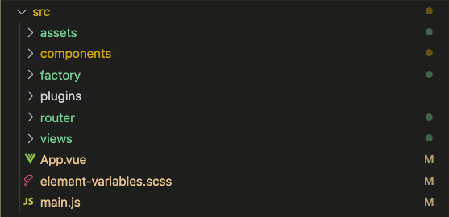
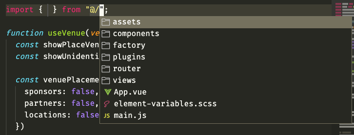

# vue-at-alias-vscode-boilerplate

These two files configure VS Code to respect `@` as an alais to the `src/` directory of your Vue project.

## Directions

Copy [`jsconfig.json`](./jsconfig.json) and [`.vscode/settings.json`](./.vscode/settings.json) into your project.

## Results

For example, if your project looked something like this:

After added the two files, you'd get hits like so:

Hopefully this comes in handy for someone else as well!
